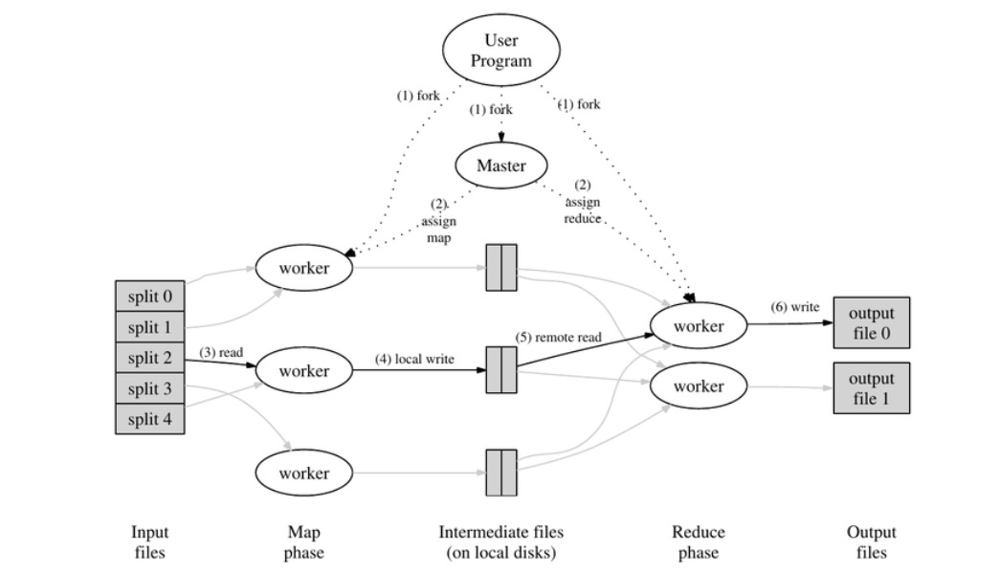
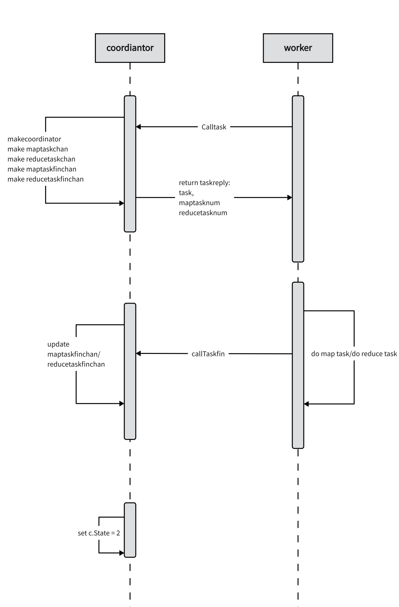
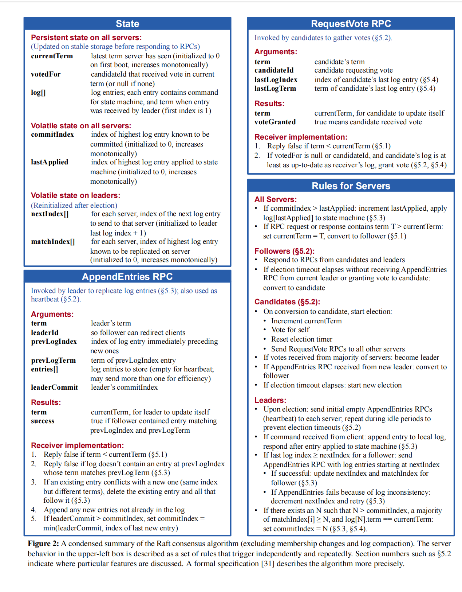

# MIT6.824

MIT6.824(现6.5840)分布式系统lab1-lab4，渐进式实现一个KV分布式系统

课程主页: <https://pdos.csail.mit.edu/6.824/labs/lab-mr.html>


## Lab1 MapReduce 
### 前置要求
Go语言基础(Lec2 go crawler demo:<https://go.dev/tour/concurrency/1>)，重点掌握管道相关知识，MapReduce论文

### MapReduce解析
Map是接收一组键值对，并且通过特定方式对其排序（在Lab1提到的word count例子中，键是词，值是词出现的次数，排序之后同一个词会集中出现）。
Reduce则合并相同键的值，以word count为例，Reduce是将相同单词的值（即出现的次数）相加。


- 系统会启动一个或多个Master，需要执行任务的机器启动Worker来处理任务。Master主要职责是分配任务给Worker，Master可以随机选择空闲的Worker来分配任务，或者Worker主动向Master请求任务；
- 获得map任务的Worker，读取数据分片，生成一组key/value键值对的中间值集合，并将数据写到本地文件，这里每个map任务数据分为R份(Master创建reduce任务的数量)，通过用户定义的分区函数(如hash(key) mod R)决定将key存在哪个文件；
- 获得reduce任务的Worker，通过远程调用请求数据，数据加载完毕后，对数据进行排序，之后遍历数据，将相同key的数据进行合并，最终输出结果；
- 当所有的map和reduce任务完成了，整个MapReduce程序就处理完毕了，Worker得到处理后的数据，通常会保存在不同的小文件中，合并这些文件之后就是最重要的结果。

### 实验过程


- Map阶段成功输出中间文件：
  
```json
     {"Key":"Being","Value":"1"}
     {"Key":"it","Value":"1"}
     {"Key":"it","Value":"1"}
     {"Key":"it","Value":"1"}
     {"Key":"Being","Value":"1"}
     {"Key":"Being","Value":"1"}
     {"Key":"Merriman","Value":"1"}
     {"Key":"Cecily","Value":"1"}
     {"Key":"SCENES","Value":"1"}
     {"Key":"W","Value":"1"}
```

- Reduce阶段成功输出**mr-out-***

 ```c
     Conan 3
     Concorde 1
     Confess 1
     Constantinople 4
     Contentment 1
     Contested 1
```

#### 困难与思考

1. map过程生成的中间文件到了reduce阶段没办法解码，发现是reduce阶段decoder应该直接解码到kv
   最后一个crash test fail, 原因可能是在向maptaskfin管道发送完成信息的时候，worker还在向maptaskchan取任务，但是实际上此时管道内已经没有任务可以取出来了。

```go
for {
    var kv []KeyValue
    if err := dec.Decode(&kv); err != nil {
        break
    }

    intermediate = append(intermediate, kv...)

}
```

2. 为实现整个系统运行的稳定性，代码要实现检测worker超时相应的功能，超过10s未完成则重发任务，为此编写timetick函数，**每隔一秒钟coordinator都要检查一次**。一开始用chan存储task的开始时间和对应的task（出于线程安全的考虑），在遍历chan的时候却发现无法跳出遍历循环，因为go的channel是没有元素也会一直去取，而且更严重的问题是，每次取出一个task检查运行时间，如果未超时都要重新放进去，程序执行效率低下。因此改用数组存储，虽然目前没有发现线程安全引发的问题，但是仍然想尝试用一种更加优雅、最大保证线程安全的办法。

3. 第二点里面提到检查用的是timetick函数，一秒钟检查一次，其实还可以用go的特性goroutine实现，并发执行不影响其他的进程。

## Lab2 Raft
### 参考资料
Raft官网: https://raft.github.io/
图形化教程：http://thesecretlivesofdata.com/raft/
Raft是一个分布式一致性算法，用于在分布式系统中实现一致性状态机，保证分布式系统的一致性。

