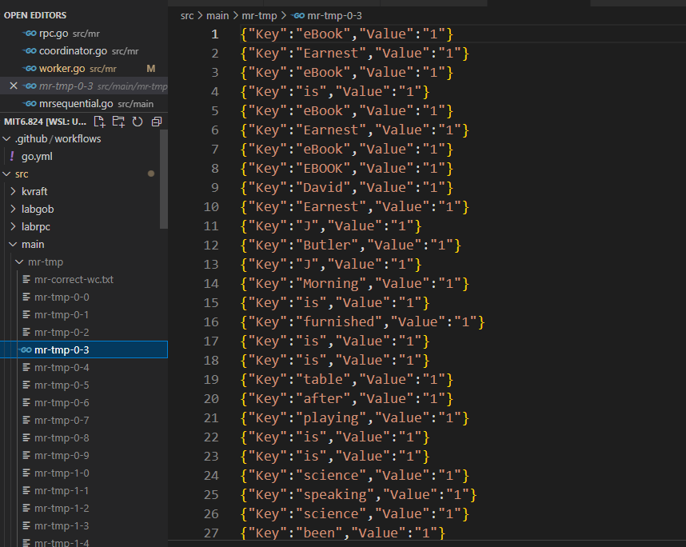

# MIT6.824

MIT6.824(现6.5840)分布式系统lab1-lab4,渐进式实现一个KV分布式系统。

课程主页: <https://pdos.csail.mit.edu/6.824/labs/lab-mr.html>

前置要求：Go语言基础，重点掌握管道相关知识；MapReduce论文

## Lab1 MapReduce

Map是接收一组键值对，并且通过特定方式对其排序（在Lab1提到的word count例子中，键是词，值是词出现的次数，排序之后同一个词会集中出现）。
Reduce则合并相同键的值，以word count为例，Reduce是将相同单词的值（即出现的次数）相加。

- 系统会启动一个或多个Master，需要执行任务的机器启动Worker来处理任务。Master主要职责是分配任务给Worker，Master可以随机选择空闲的Worker来分配任务，或者Worker主动向Master请求任务；
- 获得map任务的Worker，读取数据分片，生成一组key/value键值对的中间值集合，并将数据写到本地文件，这里每个map任务数据分为R份(Master创建reduce任务的数量)，通过用户定义的分区函数(如hash(key) mod R)决定将key存在哪个文件；
- 获得reduce任务的Worker，通过远程调用请求数据，数据加载完毕后，对数据进行排序，之后遍历数据，将相同key的数据进行合并，最终输出结果；
- 当所有的map和reduce任务完成了，整个MapReduce程序就处理完毕了，Worker得到处理后的数据，通常会保存在不同的小文件中，合并这些文件之后就是最重要的结果。

- 成功输出中间文件：
     

- 成功输出mr-out-*

困难：
map过程生成的中间文件到了reduce阶段没办法解码，发现是reduce阶段decoder应该直接解码到kv
最后一个crash test fail, 原因可能是在向maptaskfin管道发送完成信息的时候，worker还在向maptaskchan取任务，但是实际上此时管道内已经没有任务可以取出来了。
、、、
for {
    var kv []KeyValue
    if err := dec.Decode(&kv); err != nil {
        break
    }

    intermediate = append(intermediate, kv...)
}
、、、
每次循环都创建了一个kv

## Lab2 Raft

Raft是一个分布式一致性算法，用于在分布式系统中实现一致性状态机，保证分布式系统的一致性。
